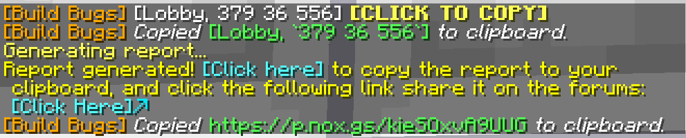

# Build Bugs
> A simple utility to speed up (build-) bug reports.

### Requirements
You need Minecraft 1.20.2 and [Noxesium 1.1.1](https://modrinth.com/mod/noxesium/version/1.1.1). 

### Usage

This mod adds the ``/buildbug`` command and a hotkey (default ``U``) to quickly gather information about your location.

- ``/buildbug`` - Prints out location information, same as the hotkey.
- ``/buildbug config clipboard <true/false>`` (default: ``false``) - If set to true, automatically copies any ``/bugreport`` links or ``/buildbug`` coordinates to the clipboard.
- ``/buildbug config debug <true/false>`` (default: ``false``) - If set to true, prints out any incoming noxesium packet and information about the current internal state.
- ``/buildbug config eventIP <IP>`` (default:`` ``) - Allows the mod to also function on the specified server.
- ``/buildbug version`` - Prints out the version of the mod.

